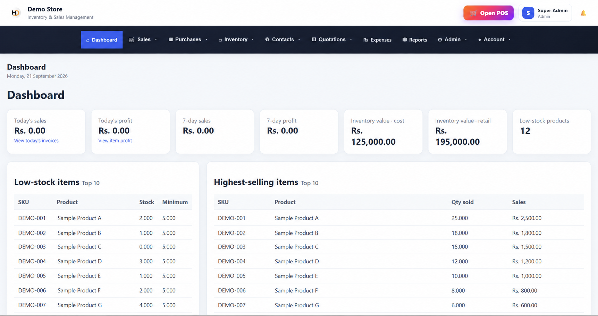
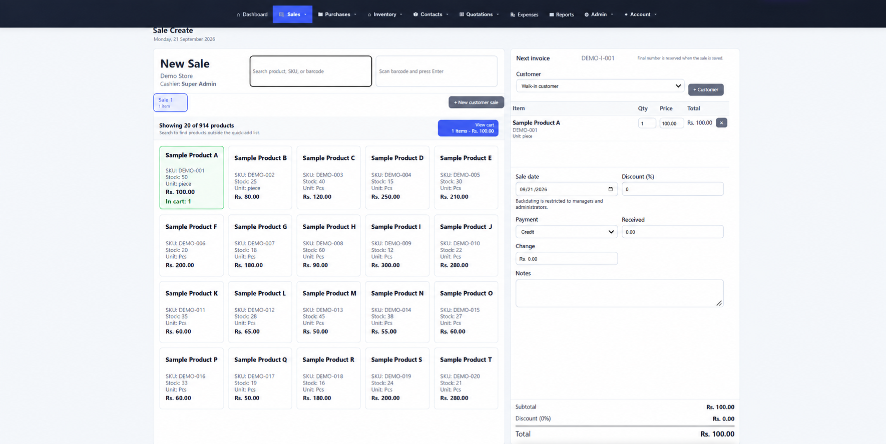
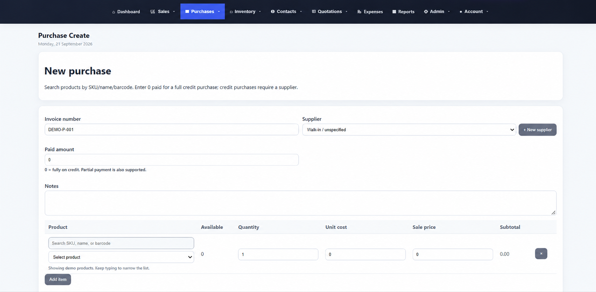
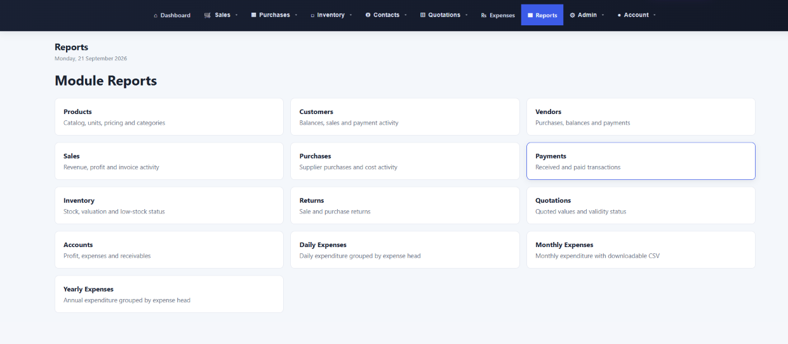
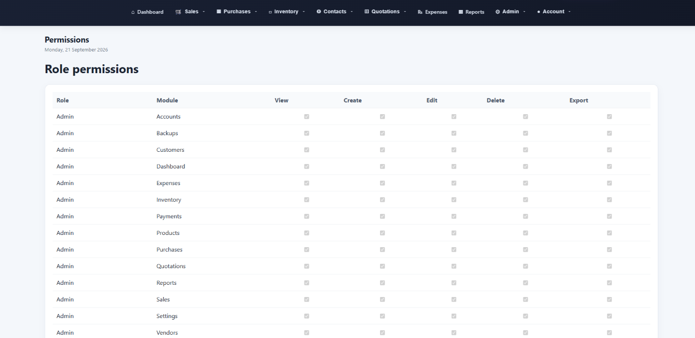

# Custom POS and Inventory Management System

A case study of a custom web-based Point of Sale and inventory management system developed for day-to-day retail operations.

> **Confidentiality notice:** The source code, database, credentials, customer information, financial records, and private business data are not included in this public repository.

## Project Overview

The system provides a centralized platform for managing sales, purchases, inventory, customers, suppliers, payments, receipts, reporting, and staff access.

It was designed to replace disconnected manual processes with a structured, secure, and practical business-management workflow.

## Project Status

* Production system completed
* Deployed on a private live environment
* Used for real business operations
* Source code maintained privately
* Public repository provided as a portfolio case study only

## Main Features

### Point of Sale

* Fast product selection
* SKU-based product search
* Adjustable quantities and prices
* Cash and credit sales
* Automatic payment calculations
* Customer selection
* Discount handling
* Receipt generation
* Cashier identification on receipts

### Inventory Management

* Product and SKU management
* Stock-level tracking
* Inventory adjustments
* Purchase-based stock updates
* Sales-based stock deductions
* Low-stock visibility
* Product filtering and sorting
* Inventory valuation controls

### Sales Management

* Complete sales history
* Cash and credit sales filtering
* Backdated sales for authorized users
* Sales adjustments
* Payment tracking
* Receipt printing
* Cashier identification
* Daily sales reporting

### Purchase Management

* Supplier-based purchases
* Purchase history
* Purchase-return workflow
* Stock updates from purchases
* Purchase payment tracking
* Supplier balance management

### Customer and Supplier Management

* Customer records
* Supplier records
* Opening balances
* Credit-balance tracking
* Transaction histories
* Customer and supplier status management

### Role-Based Access

The system provides separate permissions for different staff roles.

#### Administrator

* Full system access
* User and permission management
* Financial and operational reporting
* System configuration

#### Manager

* Sales and purchase oversight
* Inventory management
* Backdated transactions
* Transaction adjustments
* Staff activity monitoring
* Profit and performance reporting

#### Cashier

* Point-of-sale access
* Customer selection
* Sales processing
* Receipt generation
* Restricted access to profit and inventory-cost information

## Operational Controls

* Manager notification when a cashier changes a product price
* Automatic zero received amount for credit sales
* Restricted access to sensitive profit information
* Clickable dashboard summaries
* SKU-based product filtering
* Cash and credit sales filters
* Controlled backdated transactions
* Cashier details on receipts
* Protected posted purchase records

## Reporting

The system supports operational and management reporting, including:

* Daily sales
* Profit summaries
* Cash sales
* Credit sales
* Inventory values
* Product movement
* Customer balances
* Supplier balances
* Purchase activity
* Staff activity

## Technology Overview

* PHP
* MySQL
* HTML5
* CSS3
* JavaScript
* Responsive web interface
* Role-based access control
* Server-side validation
* Relational database design

Specific infrastructure, credentials, database structures, and security configurations remain private.

## Business Benefits

* Reduces manual calculations
* Improves stock accuracy
* Provides clearer sales tracking
* Separates staff responsibilities
* Protects sensitive financial information
* Improves transaction accountability
* Centralizes customer and supplier records
* Supports faster management decisions

## Interface Screenshots

The following screenshots use sanitized demonstration data. No client, customer, supplier, financial, or authentication information is included.

### Dashboard

The dashboard provides sales summaries, profit visibility, inventory valuation, low-stock monitoring, and product-performance information.

### Point of Sale

The POS interface supports product and SKU search, cart management, customer selection, cash and credit payments, discounts, backdated sales controls, and receipt generation.

### Purchase Management

The purchase workflow handles suppliers, invoice references, product selection, quantities, costs, sale prices, credit purchases, and stock updates.

### Reporting Modules

Reporting modules cover products, customers, vendors, sales, purchases, payments, inventory, returns, quotations, accounts, and expenses.

### Role-Based Permissions

Administrators can control view, create, edit, delete, and export permissions independently for each system module.
## Live Deployment

The application is deployed in a private production environment.

A public login or demonstration account is not provided to protect operational business data and system security.

## Source Code

The complete source code is private and is not included in this repository.

Selected functionality can be demonstrated during a client meeting when appropriate, without exposing credentials, confidential records, or proprietary business logic.

## Author

**Syed Abdullah Zahid**
SOFTECH PARK (SMC-PVT) LTD

Full-stack web development, PHP applications, POS systems, inventory management, Shopify, WordPress, API integrations, and business automation.
